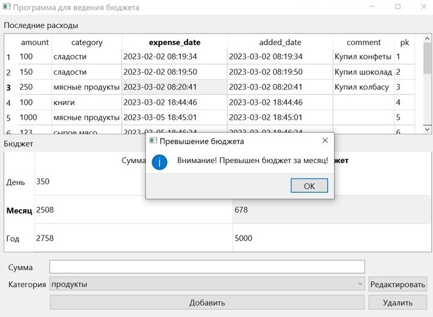

# Простая программа для управления личными финансами
#### (учебный проект для курса по практике программирования на Python)

Реализован следующий функционал:
1) добавление записи с помощью кнопки "добавить" при выборе нужной категории в выпадающем списке и вводе суммы
2) удаление записи с помощью щелчка мышкой по нужной строке и нажатию на кнопку "удалить"
3) редактирование категорий по кнопке "редактировать"
4) отслеживание расходов за день, месяц, год совпадающими с днем, месяцем, годом в выбранной по щелчку мышки строке
5) ограничение расходов при задании их в соответствующей колонке бюджета (при нажатии клавиши "enter" всплывает предупреждающее окно, если бюджет был превышен)

